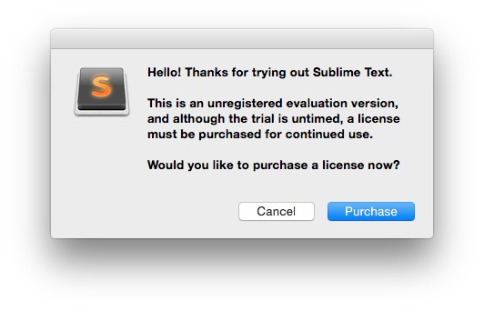

# Sublime Text cheat sheet
Notes about the perfect workflow in Sublime Text, keyboard shortcuts for Mac and Windows, snippets, the best plugins, tips, techniques and more.

*(work in progress)* 

## Download
The **Sublime Text** (ST) editor [can be downloaded for free](http://www.sublimetext.com/). It’s available for Mac, Windows, and Linux as an unlimited evaluation period: the program will display an alert from time to time asking to purchase a license code.

## Initial setup

### Settings
ST has no GUI when it comes to modify the program's settings, it's all done by modifying text files. By default, there are two entries under the **Preferences** menu: 
*Settings - Default* and *Settings - User*.

####Settings - Default
This file contains the default settings. Every time ST is updated, this file will be refreshed and all the changes previously done will be lost.

####Settings - User
This is the file to modify in order to have permanent changes for the current user, like changing the default text size or the color scheme.
*Shortcut on Mac OS:* ⌘,

## Multiple cursors

### Sequence select
After having selected a variable or any other word, hitting ⌘D will highlight the next occurrence of that word and multiple cursors will be automatically activated, so the user can edit all the selected words at the same time. This can also happen when the cursor is placed inside a word, just by clicking it: pressing ⌘D will select the entire word, then pressing again will also select every following occurrence of the word.
This also works by highlighting multiple words, symbols, spaces or every possible selection.

### Full select
The keyboard shortcut ^⌘G (Control + Command + G) allows to select every occurrence of a word in the entire file. This, as the previous shortcut, can be done either by selecting the desired words, or by just placing the cursor at the beginning, at the end, or in the middle of a word.
